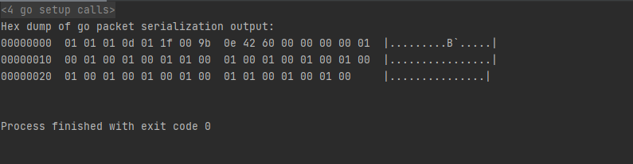

# DIS PDU Library for Golang

## Current standard: IEEE 1278.1

Currently: Header and partly body can be work.

Referencing: 

http://faculty.nps.edu/brutzman/vrtp/mil/navy/nps/disEnumerations/JdbeHtmlFiles/pdu/29.htm

https://www.sisostds.org/DesktopModules/Bring2mind/DMX/API/Entries/Download?Command=Core_Download&EntryId=52359&PortalId=0&TabId=105

